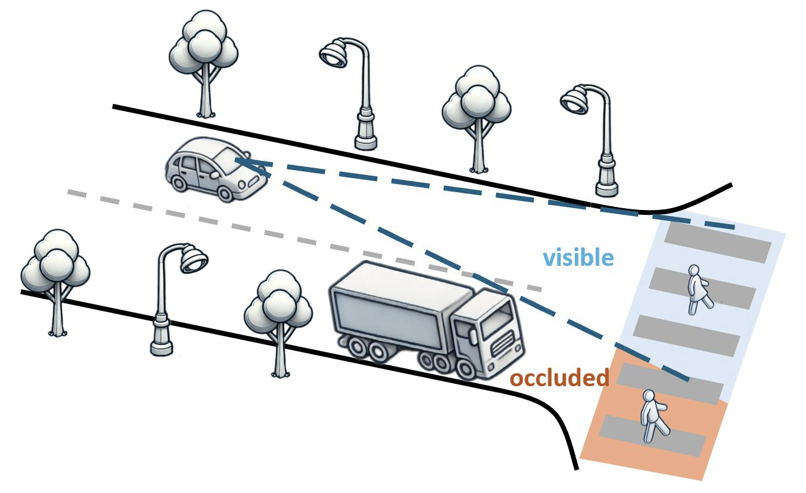

# Safe Driving in Occluded Environments

## Introduction

This repository implements [Safe Driving in Occluded Environments](https://arxiv.org/abs/2510.13114),
which uses probabilistic safety constraints to help autonomous vehicles navigate around hidden hazards.
It includes CARLA experiments for estimating safety probabilities and comparing the proposed controller with baseline methods.

[](intersection_3D_trees.pdf)

## Setup

The experiments use [CARLA 0.9.10](https://carla.readthedocs.io/en/0.9.10/). Create and activate the Conda environment from the repository root:

```sh
conda env create -f env.yaml
conda activate extreme_driving
```

From the CARLA installation directory, start the simulator on port 2026:

```sh
./CarlaUE4.sh --world-port=2026
```

Run the Python commands below in a separate terminal from the repository root, with the environment activated, unless another directory is specified.

If Python reports `ImportError: No module named 'carla'`, add the CARLA egg to `PYTHONPATH`, replacing the example path with your installation path:

```sh
export PYTHONPATH="$PYTHONPATH:/path/to/CARLA/PythonAPI/carla/dist/carla-0.9.10-py3.7-linux-x86_64.egg"
```

## Safety Probability Estimation

### Run a single simulation

Run the nominal cruise controller with the default initial position and speed:

```sh
python cruise_control.py
```

Set an initial state or save frames for a video:

```sh
python cruise_control.py --init_pos=x --init_speed=v
python cruise_control.py --save
```

Boolean flags such as `--save`, `--save_time`, and `--save_trajectory` are false when omitted and true when present. Emergency stopping is enabled by default; use `--no-emergency` to disable it on controllers that support this option.

### Generate a lookup table

Estimate safety probabilities over a grid of initial positions and speeds:

```sh
python create_risk_lookup.py
```

The output is `risk_lookup_table<file_id>.csv` (`risk_lookup_table0.csv` by default), with columns `init_pos`, `init_speed`, `total_safe`, and `total_unsafe`.

| Argument | Description |
| --- | --- |
| `--xmin`, `--xmax` | Lower and upper bounds of initial position |
| `--xdelta` | Position discretization step |
| `--vmin`, `--vmax` | Lower and upper bounds of initial speed |
| `--vdelta` | Speed discretization step |
| `--time_horizon` | Horizon for estimating long-term safety probability |
| `--N` | Number of trials per initial state |
| `--file_id` | Suffix for the output CSV filename |

If CARLA crashes with `Disabling core dumps. Signal 11 caught`, reduce `N`, adjust the iteration count in `lookup.sh`, and run:

```sh
./lookup.sh
```

This script restarts CARLA between iterations and saves a sequence of CSV files. See [Visualization and Evaluation](#visualization-and-evaluation) for plotting instructions.

## Safe Control

The processed lookup table is included as `risk_lookup_table.csv`. To combine new raw lookup tables, place them in a folder named `tables` and run:

```sh
python lookup_postprocessing.py
```

Run the proposed safe controller:

```sh
python safe_control.py
```

| Argument | Description |
| --- | --- |
| `--init_pos` | Initial position in simulation coordinates, in the documented range [-100, 82] m |
| `--init_speed` | Initial speed (nonnegative) |
| `--alpha` | Positive control constant |
| `--epsilon` | Risk tolerance between 0 and 1 |
| `--save` | Save frames for a bird's-eye-view video |
| `--save_brake` | Save velocity and control (brake or throttle) plots versus time |
| `--save_pos` | Save position plots versus time |
| `--save_prob` | Save safety probability plots versus time |
| `--save_time` | Save simulation time to `safe_control_time.txt` |
| `--save_trajectory` | Save velocity, position, control, and safety probability to `safe_velocity.txt`, `safe_position.txt`, `safe_u.txt`, and `safe_F.txt` |

The paper places the occlusion at the origin by subtracting 82 m from simulation positions. For example, an initial simulation position of -38 m corresponds to -120 m in the paper.

## Visualization and Evaluation

### Figures 1 and 2: scenario and simulation setup

- **Figure 1:** [Intersection PowerPoint source](visualization/figure1/intersection_3D_figure.pptx).
- **Figure 2:** [CARLA setup source](visualization/figure2/carla_setup.pptx).

### Figure 3: safety probability lookup table

From `visualization/figure3`, run:

```sh
python plot_lookup.py
```

The script saves `table_trajectory.pdf`. The heatmap is smoothed with a Gaussian filter.

### Figure 4: controller comparisons

Run the PID, risk-based, OA-MPC, planning-based, and proposed controllers from the repository root to save their trajectories:

```sh
python pid_control.py --init_pos=-38 --init_speed=0 --save_trajectory
python risk_based_control.py --init_pos=-38 --init_speed=0 --epsilon=0.02 --save_trajectory
python oa_mpc_control.py --init_pos=-38 --init_speed=0 --save_trajectory
python planning_based_control.py --init_pos=-38 --init_speed=0 --save_trajectory
python safe_control.py --init_pos=-38 --init_speed=0 --epsilon=0.05 --alpha=0.2 --save_trajectory
```

Run the sixth method, TransFuser, in a separate terminal from the directory containing `transfuser_control.py`, using its environment:

```sh
conda activate tfuse-1
python transfuser_control.py --init_pos=-38 --init_speed=0 --save_trajectory
```

Experimental trajectory text files are included in `visualization/figure4`. To plot new runs, replace the corresponding trajectory files there with the newly saved outputs, using the filenames expected by the plotting scripts. From that directory, run:

```sh
python velocity_time.py
python velocity_distance.py
```

### Figure 5

Use the [Figure 5 notebook](https://colab.research.google.com/drive/1ZOmGRfEGCCozjD5iQtIjaN3IQuKomPJj#scrollTo=58qCO4V4IPtw).

### Table II: safety and travel time

Set the initial states, risk tolerances, and number of trials in `evaluate_time_risk.py`, then run:

```sh
python evaluate_time_risk.py
```

The script saves `safe_control_risk.csv`, `cruise_control_risk.csv`, `risk_control_risk.csv`, and `transfuser_control_risk.csv`. These contain initial states, safe and unsafe trial counts, safety probabilities, and average time horizons; the safe and risk-based controller tables also include risk tolerance.

## Citation

If you use this work, please cite:

```bibtex
@article{wang2025safe,
  title={Safe Driving in Occluded Environments},
  author={Wang, Zhuoyuan and Jia, Tongyao and Rajborirug, Pharuj and Ramesh, Neeraj and Okuda, Hiroyuki and Suzuki, Tatsuya and Kar, Soummya and Nakahira, Yorie},
  journal={arXiv preprint arXiv:2510.13114},
  year={2025}
}
```
